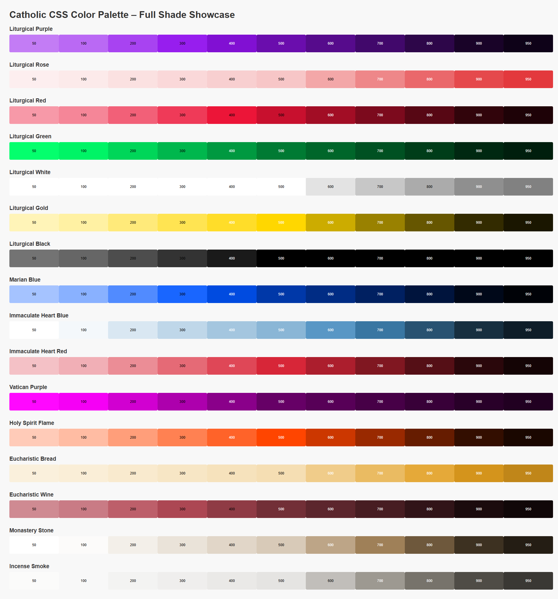

# Catholic Color Palette

A symbolic Catholic color system using CSS custom properties for use in web and design projects.

## Usage

### 1. Install

```bash
npm i catholic-css
```

### 2. Usage
#### 2.1 Import the CSS
You can import the CSS file directly into your project. This will give you access to all the custom properties defined in the palette.

```css
@import 'catholic-css/dist/catholic-palette.css';
```

### 2.2 Use the Custom Properties
You can use the custom properties in your HTML or CSS files. For example:

```html
<div style="background: var(--marian-blue); color: var(--liturgical-white);">
  Feast of the Immaculate Conception
</div>
```
## 3 Color Palette Preview



## 4 License

This project is licensed under the **CodexCommunion Digital Code License (CCCL) v1.0**.  
See the [LICENSE](./LICENSE) file for full details.

